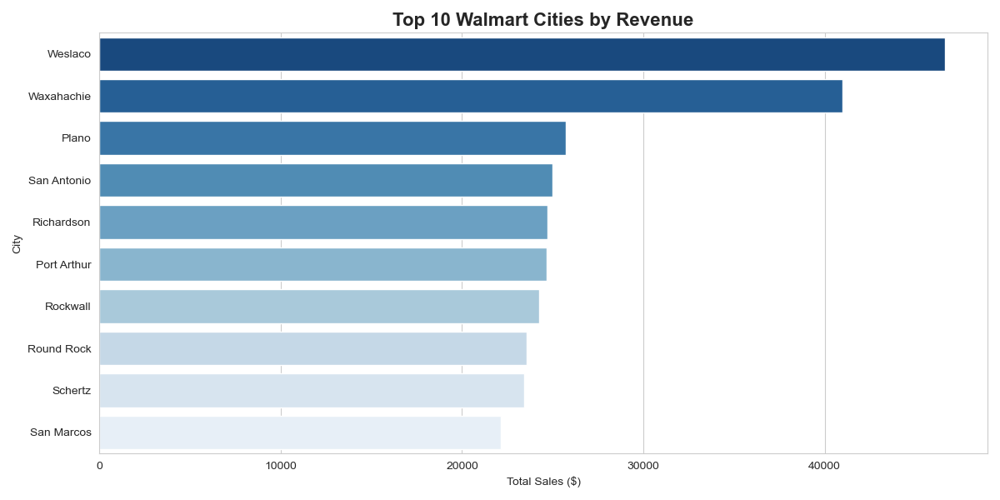

# 🛒 Walmart Sales Analytics — End-to-End Data Analysis Project


## 📌 Project Overview
An end-to-end data analysis project on 10,000+ real Walmart transactions using Python and PostgreSQL. This project covers the complete data pipeline from raw CSV ingestion to an interactive Streamlit dashboard.

## 🎯 Business Questions Answered
- Which cities and branches generate the most revenue?
- Which product categories dominate sales?
- What are the peak sales days and months?
- Which payment methods are most popular?
- What is the monthly revenue growth rate?
- Which branches have the best and worst customer ratings?

## 🛠️ Tech Stack
| Tool | Purpose |
|---|---|
| Python | Data cleaning & analysis |
| Pandas | Data manipulation |
| PostgreSQL | Database storage & SQL queries |
| SQLAlchemy | Python-PostgreSQL connection |
| Matplotlib & Seaborn | Data visualization |
| Streamlit | Interactive dashboard |
| Git & GitHub | Version control |

## 📊 Dataset
- **Source:** Kaggle — Walmart 10K Sales Dataset
- **Size:** 10,020 transactions after cleaning
- **Features:** Branch, City, Category, Unit Price, Quantity, Date, Time, Payment Method, Rating, Profit Margin

## 🔍 Key Insights
- **Home & Lifestyle** and **Fashion Accessories** account for **81% of total revenue**
- **Saturday** is the highest revenue day ($186K) while **Monday** is the lowest ($156K)
- **November** showed a massive **+249% revenue growth** — classic holiday season spike
- **Credit Card** is the most popular payment method (42% of transactions)
- **Huntsville** branch has the highest customer rating (6.81) among all branches
- **Weslaco** is the top city by revenue ($46,644) but has a below average rating

## 📁 Project Structure
```
walmart-sales-analytics/
│
├── Walmart.csv          # Raw dataset
├── analysis.py          # Data cleaning, SQL queries & visualizations
├── dashboard.py         # Streamlit interactive dashboard
├── top_cities.png       # Top 10 cities chart
├── category_sales.png   # Revenue by category chart
├── payment_methods.png  # Payment distribution chart
├── monthly_trend.png    # Monthly sales trend chart
└── README.md            # Project documentation
```

## 🚀 How to Run

### 1. Clone the repository
```bash
git clone https://github.com/AnithaMorampudi/walmart-sales-analytics.git
cd walmart-sales-analytics
```

### 2. Install dependencies
```bash
pip install pandas sqlalchemy psycopg2-binary matplotlib seaborn streamlit
```

### 3. Set up PostgreSQL
- Create a database called `walmart_db`
- Update the connection string in `analysis.py` and `dashboard.py` with your credentials

### 4. Run the analysis
```bash
python analysis.py
```

### 5. Launch the dashboard
```bash
streamlit run dashboard.py
```

## 📸 Dashboard Preview


## 👩‍💻 Author
**Anitha Morampudi**
- LinkedIn: [linkedin.com/in/anitha-morampudi](https://linkedin.com/in/anitha-morampudi)
- Email: anitham200110@gmail.com
